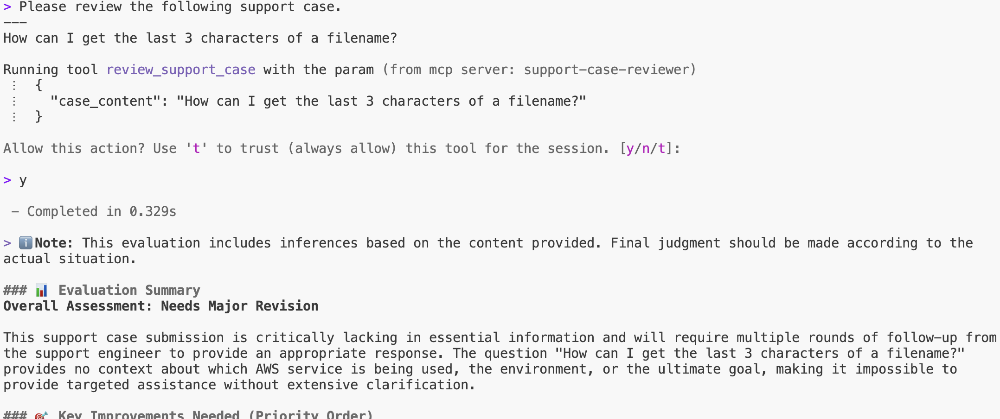
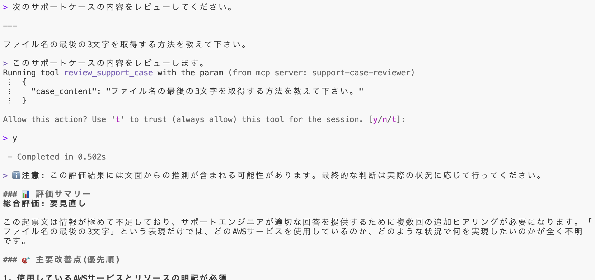

# Support Case Reviewer

An MCP server for reviewing support case content.

サポートケースの内容をレビューするための MCP サーバーです。

## Prerequisites

- Install `uv` from [Astral](https://docs.astral.sh/uv/getting-started/installation/) or the [GitHub README](https://github.com/astral-sh/uv#installation)
- Install Python 3.10 or newer using `uv python install 3.10` (or a more recent version)

---

- [Astral](https://docs.astral.sh/uv/getting-started/installation/) または [GitHub README](https://github.com/astral-sh/uv#installation) から `uv` をインストール
- `uv python install 3.10` を使用して Python 3.10 以降をインストール（またはより新しいバージョン）

## Configuration

Add this to your MCP client settings:

MCP クライアントの設定に以下を追加してください：

```json
{
  "mcpServers": {
    "support-case-reviewer": {
      "command": "uvx",
      "args": [
        "--from",
        "git+https://github.com/aws-samples/sample-support-case-reviewer.git",
        "support-case-reviewer"
      ]
    }
  }
}
```

## Available Tools

### `review_support_case`

Returns a prompt for reviewing support case content based on [Technical Support Guidelines](https://aws.amazon.com/jp/premiumsupport/tech-support-guidelines/).

サポートケースの内容を[技術的なお問い合わせに関するガイドライン](https://aws.amazon.com/jp/premiumsupport/tech-support-guidelines/)に基づいてレビューするためのプロンプトを返却します。

**Parameters:**
- `case_content` (string): Support case content to review / レビュー対象のサポートケース内容

**Returns:**
A prompt for reviewing based on the guidelines / ガイドラインに基づいてレビューするためのプロンプト

## Usage Example

1. Configure the MCP server (see Configuration section above)
2. Use the `review_support_case` tool with your case content

Example:
```
Please review the following support case.
---
[Your support case content]
```



---

1. MCP サーバーを設定します（上記の Configuration セクションを参照）
2. `review_support_case` ツールをケース内容と共に使用します

使用例:
```
次のサポートケースをレビューしてください。
---
[サポートケースの内容]
```



## Security

See [CONTRIBUTING](CONTRIBUTING.md) for more information.

## License

This library is licensed under the MIT-0 License. See the LICENSE file.
